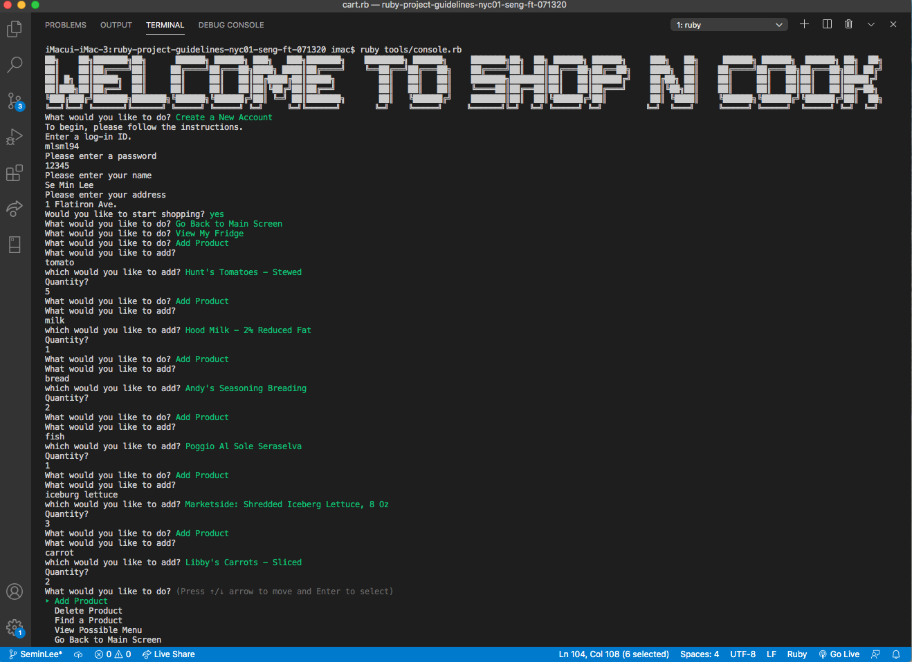

 
 

# 🍚🍚🍚 Shop N Cook 🍚🍚🍚

Register what you have in your fridge, and then find a recipe with what you have in your fridge. If there is any ingredient missing, this app will let you know, and you will be given options to shop for the ingredients. When you are done, relax and look through recipe to plan out your meal while your items deliver. 

 
 

#### DEMO

<iframe width="878" height="502" src="https://www.youtube.com/embed/TVFmlVFrffw" frameborder="0" allow="accelerometer; autoplay; encrypted-media; gyroscope; picture-in-picture" allowfullscreen></iframe>

 
 

#### This project required:
Ruby, API, CRUD action, and CLI 

 
 



