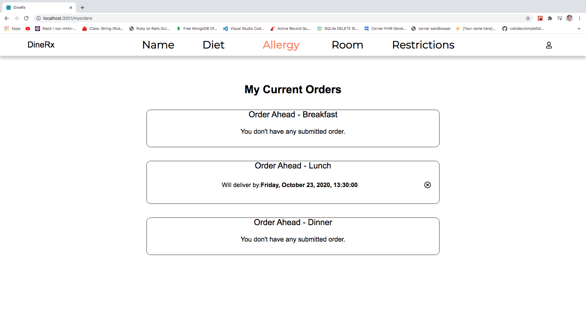

<br>
<br>

# DineRx 💊💊💊

## About✅
- I was inspired to do this project while working as a Nursing Assistant at trauma 1 hospital. I've seen many frustration in patients' eyes when they had to wait 10~15 minutes each time they call cafeteria to order their meal. With DineRx, patients now can order food online, and educate themselves about their diet as they order. 

- Patients' diets can change several times throughout their stay in the hospital. If they have a surgery scheduled, they would be placed in NPO, which means no food is allowed until further notice. A lot of patients don't know what NPO is, as well as what other diets, such as Cariac diet or Low-Sodium diet. With DineRx, patients can learn about their diet in their free time and see more importance of eating healthy. 

## Included Features✅
- User can log in using Google Map API/Auto Completion to search for their hospital.
- User can add item to the cart, view more details of the item, which includes ingredients and nutritions of the item.
- User can add items to either "order now", or "order ahead," where they can choose the date and time for the food to be delivered. 
- User can view the ordered items
- User can view the education page about their diet.

## Versions...✅
- npm 6.14.8
- yarn 1.22.4

## Used...✅
- Redux
- Thunk
- React Bootstrap
- Spoonacular API
- Postman

## Stretch goals✅
- Have more allergy lists available
- Work on the education page
- styling of meal cards

## Getting started✅
- Clone the repository
- ```npm install``` or ```yarn install```
- https://github.com/Seminlee94/DineRx-backend Clone this back end repository
- Bundle install
- ```brew install yarn``` to install yarn
- ```rails db:migrate```
- ```rails db:seed``` 
- ```npm start```

## 🚀🚀🚀Into the app 🚀🚀🚀
#### Sign in using hospital name, name, MRN number, and DOB


<br/>
<br/>

#### Once logged in, choose either order now or order ahead if you want to order for later. In this order now page, breakfast menu will be rendered between 7AM ~ 11AM, lunch between 12PM ~ 4PM, and dinner between 5PM ~ 9PM. In anything between, the page will render a CLOSED page.  


<br/>
<br/>

#### If you are curious about the details of the meal, please click on the view button and see the meal's ingredients and nutritions. Future stretch goal includes deleting/adding ingredients to the user's meal. 


<br/>
<br/>

#### This is Order ahead page. Breakfast, Lunch, and Dinner are all in one page, so patients can easily scroll up and down, and use the button to scroll to the top. If the meal is for breakfast, breakfast button will be shown upon hover. If the meal is for lunch and dinner, lunch and dinner buttons will be shown. 


<br/>
<br/>


#### Please check if you have any restrictions. If you have a restriction and your cart exceed the amount, it will give you a warning and you won't be able to submit the order form. In order to make an order, you need to meet the restriction criteria. 


<br/>
<br/>

#### You can check your orders and their status in this page.


<br/>
<br/>

#### You can see information about your diet. Educations for patients' diets can be very helpful for both patients and healthcare workers.  


<br/>
<br/>
<br/>


#### Thank you for your interest! I really enjoyed working on this project because it has so many potentials. I will continue to expand this project in the near future.

<br>
<br>

### DEMO
<iframe width="957" height="447" src="https://www.youtube.com/embed/djjivshj63w" frameborder="0" allow="accelerometer; autoplay; clipboard-write; encrypted-media; gyroscope; picture-in-picture" allowfullscreen></iframe>

<br>
<br>

#### This project required:
React, Redux, Rails, CSS, HTML, React-Bootstrap, Spoonacular API, Postman, PostgreSQL

<br>
<br>

<p class="text-center">

</p>
<p class="text-center">

</p>