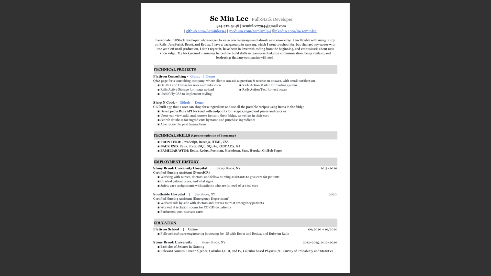

# **About Me**
 
Hi I am **{{ site.author.name }}** :wave:, 
My expected graduation date from Flatiron is October 23rd, 2020. I have worked at health care field for 5 years as a nursing assistant, and was in Stony Brook School of Nursing, pursuing for Bachelor of Science with Nursing major.

Although I only had one year left until graduation, my first 4-weeks of coding experience captivated me and made me decide to quit nursing school and dive in deeper into the developer field. 

The reason that I started studying for coding in the first place was becasue a project idea came into my mind while working at hospital. I really liked the idea, so I started to study coding during my nursing class. I am still in progress with the project, but I am hoping to present it for my capstone project.

Other than nursing background, I was in biomedical engineering major until 3rd year in college, so I took a lot of mathematics, physics related studies. These classes gave me build up my problem solving skills, which helped me power through Flatiron school. 

I would like to share my diverse knowledge with other developers, as well as learn from the others. In next 5 years, I envision myself working as a full-stack engineer, working collaboratively with others of common goals to pursue for the best for the company.

## Programming Skills
 
- Ruby
- Ruby on Rails
- Javascript
- React
- HTML5
- CSS 
- PostgreSQL
- MongoDB
 

<!-- 




 -->

## Hobbies
 
Jogging, and Hiking with my 4 year old girl, Cooking, Football, Lacrosse, and of course, CODING  
 

## Certifications
- M001: MongoDB Basics

## Resume

