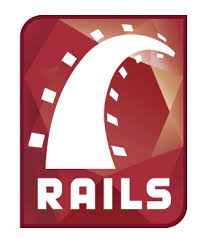
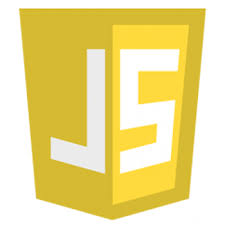
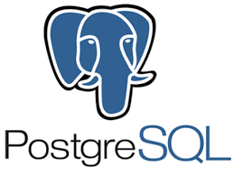

# **About Me**
 
Hi I am **{{ site.author.name }}** :wave:, 
<!-- My expected graduation date from Flatiron is October 23rd, 2020. I have worked at health care field for 5 years as a nursing assistant, and was in Stony Brook School of Nursing, pursuing for Bachelor of Science with Nursing major. -->

<!-- Although I only had one year left until graduation, my first 4-weeks of coding experience captivated me and made me decide to quit nursing school and dive in deeper into the developer field.  -->

<!-- The reason that I started studying for coding in the first place was becasue a project idea came into my mind while working at hospital. I really liked the idea, so I started to study coding during my nursing class. I am still in progress with the project, but I am hoping to present it for my capstone project. -->

<!-- Other than nursing background, I was in biomedical engineering major until 3rd year in college, so I took a lot of mathematics, physics related studies. These classes gave me build up my problem solving skills, which helped me power through Flatiron school.  -->

<!-- I would like to share my diverse knowledge with other developers, as well as learn from the others. In next 5 years, I envision myself working as a full-stack engineer, working collaboratively with others of common goals to pursue for the best for the company.  -->

I am a passionate programmer who transitioned into software engineering from nursing field. I have worked at health care field for 5 years as a nursing assistant, and went to Stony Brook School of Nursing to pursue Bachelor of Science with Nursing major. 

I came across some project ideas that I wanted to work on, so I started studying coding by myself. When I thought that programming is for me, I decided to join Flatiron bootcamp, where I learned Ruby, Ruby on Rails, Javascript, React.js with Redux, PostgreSQL, and SQLite.

As a former healthcare worker, I have strong communication skills, teamwork, and working at a fast-paced, pressured environment. I can learn with fast pace, and am eager to learn.

Since I was first enrolled into Stony Brook University as a Biomedical Engineering major, I have taken majority of Mathmatics, Statistics, and Physics classes for the major. My strong problem solving skills comes from those classes, as well as my Python skill.

## Programming Skills
 

<!--  -->

<!-- 

 -->

 <!-- Ruby
- Ruby on Rails
- Javascript
- React
- HTML5
- CSS 
- PostgreSQL
- MongoDB -->

<!--  -->
 

{::nomarkdown}

{:/}

<!-- 




 -->

## Hobbies
 
Jogging and Hiking with my 4 year old girl, Cooking, Football, Lacrosse, and of course, CODING  
 

## Certifications
- M001: MongoDB Basics

## Resume
<!--  -->
<a href="https://drive.google.com/file/d/1QGfLAaisMwlI3u1FHXTYs9ian_ucPHnj/view?usp=sharing" target="_blank">Click for most updated Resume</a>

